# NFC Idea Finder: project log

> **What this file is.** The running diary of the project. Every step, decision, prompt and problem goes here, in order, so that at the end it can become the README of a public GitHub repo. Written simply enough for a curious 14-year-old.
>
> **How to use it.** Add a new entry every work session. Save screenshots in `docs/img/` and link them where the 📸 markers are.

---

## The idea in one paragraph

NFC is the tech that lets you pay by tapping your phone. It also works with tiny stickers (called **tags**) that cost less than €1. When you tap a tag with your phone, something happens: a website opens, your lights switch off, a timer starts. The problem: there are thousands of ideas online, scattered across videos and articles, and it is hard to find the ones that fit **you**. So this project is a website that asks you a few questions and then suggests NFC ideas for your exact situation, links you to the video (even the exact second) where someone explains it, and tells you which tag to buy.

## Who built it, and how

Built with AI the whole time. In this log, "the user" is the person who started the project and set its goals:

- **Claude (chat and Claude Code, by Anthropic)**: planning, architecture, database design, writing prompts, cleaning data, writing and testing the code, deploying it.
- **NotebookLM (by Google)**: a tool used at the very beginning to feed the first data into the database. The sources (videos and Reddit threads) were searched for by hand; NotebookLM read them and turned them into clean, structured data that Claude could then work with.
- **Jev (by TypeSafe)** and **Claude Haiku, Sonnet and Opus**: the AI models compared against each other to run the idea bank (from step 26 on).

Being open about this is part of the point. The project became a test bench for comparing AI models and finding the best combination for one real job, so that the AI models make the everyday decisions and no human has to stay in the loop. Every model choice is backed by measured numbers.

---

## Timeline

### Day 1: Saturday 26 September 2026

#### 1. The problem and first decisions

The user's starting point: *"It's very difficult to find ideas for NFC uses that are actually good for my specific case."*

Claude asked four questions before building anything. The user's answers:

| Question | Answer | Why it matters |
|---|---|---|
| Personal tool or public product? | **Public product**, maybe monetised later | Needs to be reliable, legal and nice to use |
| How are ideas matched to people? | **AI-assisted** | An AI reads the answers and picks/explains ideas |
| Start the database empty or from existing ideas? | **Seed it with ideas the user already had** | e.g. their "peek behind" idea: tap a box to see a photo of what's inside |
| Where to host it? | **Decide later** (maybe GitLab Pages + own domain) | Depends on how the AI part ends up working |

📸 *Screenshot: the four questions and answers.*

#### 2. Architecture: how the pieces fit

```
Visitor ──> Interview (web page) ──> Backend function ──> AI (LLM) ──> Tag matcher ──> Results page
                                          ^                                 ^
                                          |                                 |
                                   Database: sources, ideas, idea–source links, tag profiles
                                          ^
                                   The user curates it
```

📸 *Screenshot: the architecture diagram Claude drew in the chat.*

Explained simply:

- **Interview page.** A normal website with questions. Can live on a free static host.
- **Backend function.** A tiny program on a server. It exists for one big reason: the AI needs a secret key (like a password that costs money when used). If that key were inside the web page, anyone could copy it and run up a bill. So the key stays hidden on the server.
- **Pre-filter.** Before asking the AI, the backend picks ~20 ideas that roughly fit (e.g. "business" ideas for a café owner). Sending the whole database every time would be slow and expensive.
- **AI (LLM).** Reads your answers plus the ~20 candidates, ranks them and explains why each fits *you*. It also works out what your tag needs to survive (on metal? outdoors? iPhone?).
- **Tag matcher.** Turns those needs into a real tag recommendation plus a search term to buy it. **Important design choice:** the AI does *not* invent product names (AIs sometimes make things up). It only outputs needs; a fixed table written and checked by the user maps needs to tags.
- **Results page.** Ideas, who explained it (credit to the creator), a link to the exact second in the video, and the tag to buy.

#### 3. What the database looks like

Five tables:

1. **Sources**: one row per video, article or book. Title, link, platform, **creator name** (so they get credit), language.
2. **Ideas**: one row per idea, written in our own words. What it does, how it works, who it's for, where it's used, iPhone/Android, difficulty, cost, what the tag needs. For money-making ideas also: business model, who pays, startup cost.
3. **Idea–source links**: connects ideas to sources, with the **timestamp** (start second) where the idea is explained. One idea can come from many videos; one video has many ideas.
4. **Tag profiles**: a small, hand-checked buying guide (chip type, sticker/card/keyfob, works on metal, waterproof…) with a search term.
5. **Idea submissions**: ideas sent in by visitors (see step 5).

Why separate ideas and sources? The same idea ("guest wifi tag") appeared in **5 different videos**. Storing it once and linking it five times avoids duplicates and shows which ideas are popular.

Timestamp detail: YouTube links can jump to a second (`&t=134s`). TikTok and Instagram can't, so there we show "explained at 0:42" as text.

Copyright detail: we write summaries in our own words and **link** to creators; we never copy or re-upload their content.

#### 4. "Tell us new uses": visitor submissions

The user's idea: a small corner link on every page, and a bigger prompt on the results page ("Didn't see your use case? Tell us").

- Short form: idea (required), where you saw it (optional), name for credit (optional), email (optional).
- Submissions go into a **review queue**. Nothing appears on the site until the user approves it. Quality stays high.
- **Stopping bots.** Public forms get spammed by robots within days. Two defences:
  - a **honeypot**: an invisible form field. Humans don't see it, bots fill it in, and we throw those away;
  - **Cloudflare Turnstile**: a free, invisible "are you human?" check (no annoying picture puzzles).
- **Privacy (GDPR).** Under EU rules, names and emails are personal data. Keep them optional, say what they're used for, delete emails once no longer needed.
- Later: the AI can pre-screen submissions (spot duplicates, suggest tags) so reviewing is fast.

#### 5. Landing page and entrepreneurs

- **Landing page.** One screen on a phone: a short hook ("Tap your phone. Make something happen."), one sentence with examples, and the **start button visible immediately** with "2 min, no signup". Everything else below the fold.
- **First question = intent.** "What do you want NFC for?"
  1. my personal life and home
  2. my job or workplace
  3. my business and its customers (reviews, menus, loyalty)
  4. starting a business around NFC

  The user's point: the site must also serve people who want to **make money** with NFC. Option 4 is for them. Their results show who the customer is, the business model and startup cost, never "earn €X per month" promises.

#### 6. Collecting the ideas: source search + NotebookLM

1. The user searched YouTube and elsewhere for NFC idea videos and added them to a **NotebookLM** notebook (24 sources: 22 videos, mostly English, 2 in Spanish, plus a book; the books were later removed, see step 19).
   📸 *Screenshot: the NotebookLM notebook with its sources.*
2. Claude wrote two prompts for NotebookLM (below). The trick was asking for **strict JSON** (a data format computers can read) with fixed field names, so the output could go straight into the database.
3. The user ran **step 1** once, then **step 2** in batches of ~5 sources. Why batches? With everything at once, NotebookLM cut answers short and mixed sources up.
   📸 *Screenshot: NotebookLM producing the JSON.*

<details>
<summary><b>Prompt 1: source inventory</b></summary>

```
List every source in this notebook as a JSON array. One object per source, with these fields:

- "source_no": number in the order you list them
- "title": the source's title
- "url": the original URL if you can see it, otherwise null
- "type": "video", "article" or "social_post"
- "platform": e.g. "YouTube", "TikTok", "Instagram", "blog", "Reddit"
- "creator_name": the channel, author or account name if stated in the source, otherwise null
- "language": e.g. "en", "fi", "es"

Rules: do not guess. If a value is not visible in the source, use null. Output only the JSON, no commentary.
```
</details>

<details>
<summary><b>Prompt 2: idea extraction (run per batch)</b></summary>

```
From the selected sources only, extract every distinct NFC use-case idea. If one source explains several ideas, create one object per idea. If the same idea appears in two sources, create one object per source (I will merge them later).

Output a JSON array. Each object has these fields:

- "idea_title": short name for the idea, max 8 words
- "summary": 1–2 sentences in your own words describing what it does and why it is useful. Do not copy sentences from the source.
- "how_it_works": short steps: what is written on the tag, what happens when tapped, which app or automation is needed
- "audience": array, any of "personal", "workplace", "business_customers", "nfc_as_business"
- "settings": array, e.g. "home", "car", "office", "shop", "restaurant", "warehouse", "events", "outdoors", "travel", "pets", "health"
- "goals": array, e.g. "automation", "share_info", "access", "reminder", "tracking", "marketing", "payments", "security", "accessibility"
- "phone_support": "any", "android_only", "iphone_only" or null
- "extra_app": app or tool needed, or null
- "difficulty": "easy", "medium" or "advanced"
- "cost_level": "under_5_eur", "5_to_50_eur", "over_50_eur" or null
- "tag_needs": { "form_factor", "on_metal", "waterproof", "rewritable", "secure_anti_clone", "chip_mentioned" }
- "business_model", "who_pays", "startup_cost_level": for money-making ideas only, otherwise null
- "source_title", "source_url", "creator_name"
- "timestamp": ONLY if the source explicitly shows it. Otherwise null. Never estimate.
- "anchor_quote": a short exact phrase from the source, max 12 words, from where this idea is explained
- "notes": anything uncertain, or null

Rules:
- Only include ideas actually described in the selected sources. Do not add your own ideas.
- If a value is not stated or clearly implied, use null rather than guessing.
- Write all text fields in English, even if the source is in another language. Keep "anchor_quote" in the source's original language.
- Output only the JSON, no commentary. If you run out of space, stop at a complete object and write CONTINUE on the last line.
```
</details>

**Why the "anchor quote"?** NotebookLM can't see video timestamps, so every timestamp came back empty (as expected). The anchor quote is an exact phrase from the video. With it, finding the exact second later takes seconds (search the video transcript for the phrase) instead of re-watching.

**Problems spotted in step 1 and how we handled them:**

| Problem | Fix |
|---|---|
| 3 videos were added to the notebook twice | Skipped the copies (24 → 21 unique sources) |
| All URLs empty | Will look them up from title + channel, then the user confirms |
| The book was from 2016 | Treat phone-compatibility info as possibly outdated (the books were later removed, step 19) |
| 2 Spanish videos | Asked NotebookLM to write in English, but keep quotes in Spanish |

#### 7. Cleaning the data (Claude + Python)

NotebookLM returned **152 idea entries** across 5 batches. Claude turned them into the database with a Python script (`scripts/build_db.py`):

- **Merged duplicates.** 152 raw entries → **78 ideas**. Example: "guest wifi" came from 4 videos; "leaving-home routine" from 6. All the sources are kept as links (**151 idea–source links**), so every creator still gets credit.
- **Sorted ideas by kind**, because not everything NotebookLM found is something a visitor can do with a sticker:

  | Kind | Count | Meaning |
  |---|---|---|
  | `diy` | 50 | You can do it with a tag + your phone |
  | `business` | 8 | A business uses it with customers |
  | `industry_example` | 9 | Real-world systems (hospitals, transit cards): inspiration only |
  | `product_feature` | 5 | NFC already built into a device (speakers, printers): no tag to buy |
  | `tip` | 6 | Advice, not an idea (e.g. "hide tags in books") |

- **Fixed errors the AI extraction made** (this is why a human + second AI check matters):
  - *"Store passwords or crypto wallet info on a hidden tag"* was listed as a security idea. It is the opposite: any phone with a free app can read a normal tag. Flagged: never recommend.
  - *"Add your door access card to your iPhone with Shortcuts"* (one video). Shortcuts can react to a card, but can't copy it or open a door with it. Flagged as likely misleading.
  - *Guest wifi tags* were marked "any phone". Android joins automatically; iPhones generally don't join wifi from a tag. Flagged to verify, with a QR-code fallback.
  - Door-unlock and garage ideas: added a security note. Never write an "unlock" link on the tag itself; let only *your* phone's automation react to it.
  - Many ideas were marked "iPhone only" just because the video used an iPhone. Added Android alternatives (NFC Tools, MacroDroid, Tasker).
- **36 ideas carry a review flag** for the user to check before anything is published.

Result files (`db/`): `sources.json` (21), `ideas.json` (78), `idea_sources.json` (151).

#### 8. Two more sources (evening)

The user added a Shortcuts video by **Stephen Robles** and a book about NFC for embedded projects (later removed, see step 19).

- The video's 3 ideas were all already in the database (bedtime scene, grocery list, play music), so they became **extra links** to existing ideas, not new ideas. This is the merge system working as planned.
- The book added a new **kind** of idea: **maker projects**, where you build your own NFC reader with a Raspberry Pi or Arduino (a tap-in attendance logger and a prepaid card for a club kiosk). Great for people who like building things.
- Caught another AI mistake: NotebookLM called the PN532 a tag chip. It is actually the **reader**. Also flagged that a card's ID can be copied, so the prepaid-card idea needs secure cards and server-side balances.

Database now: 23 sources, 80 ideas, 156 links, 38 flagged.

#### 9. Should we use "Jev" for choosing ideas?

The user found **Jev** (by TypeSafe AI), a new kind of AI model launched on 21 September 2026. Unlike chatbots, it doesn't write text. It only returns a **choice, a score or a yes/no probability**. It is also very cheap: about $0.04 per million input tokens, with output free.

What we worked out:

- **Good fit for ranking.** "How well does idea X fit this visitor? Give a score" is exactly what Jev is built for. It is so cheap it could score all 80 ideas every time, so we might not even need the pre-filter.
- **Good fit for tag needs.** "Will this tag go on metal? Outdoors? Yes/no" are yes/no questions, so Jev could answer them too.
- **Not a fit for explanations.** Jev can't write "this fits you because…". Our idea summaries are already written, though, so the results page can show those. We only add a text-writing AI later if results feel too generic. Bonus: an AI that doesn't write text can't make things up.
- **Risks.** It is only a few days old, and its speed and accuracy claims aren't proven yet. The site the user first found (jevmodel.org) is an unofficial guide, so we use the official docs. There's no information on EU data storage yet, so we only send the visitor's quiz answers, never names or emails.
- **Decision:** test it, don't commit yet. When we prototype the matching, we'll run the same fake visitors ("test personas") through Jev and through a regular small AI model, then compare quality, speed and cost.

#### 10. New direction: local first, on a Raspberry Pi

The user's priority changed: first make it work **just for them, in a browser, at home**, and make it cool enough for a portfolio. Going public (domain, paying for other people's AI use) is decided later.

New setup:

```
Browser (laptop, same wifi) ──> Raspberry Pi 5: Web app ──> Matching engine ──> SQLite database
                                                                 │
                                                                 └──> Jev API (cloud, optional)
```

- **Everything runs on the Pi**: the web app, and the database as a single **SQLite** file.
- **Jev can't run on the Pi.** It's a closed model that only runs on its maker's servers, so the Pi calls it over the internet. Its free starter tokens are plenty for one person.
- **The matching engine has three options you can switch between:** (1) simple rules, with no AI, free and offline; (2) Jev; (3) later, maybe a small AI model running on the Pi itself. Comparing them becomes part of the project story.
- **Bonus:** if the rules engine is good enough, a public version could be a free static site with no AI costs at all.

📸 *Screenshot: the local architecture diagram.*

#### 11. First working version, built in one go

The user: *"Forget about slowly and tests. We can go fast."* So Claude built the whole first version in one session.

**Name (working title): Tapwise.**

What's inside:

- **Quiz**: 8 questions, one per screen. Single-choice answers move on by themselves. Every answer matches a field in the database (who it's for, where, what the tap should do, phone, smart home gear, how hands-on, tag conditions, free text).
- **Rules engine** (`app/engines/rules.py`): gives each idea points. It removes ideas that can't work (wrong phone, far too hard), subtracts points for ideas that need smart home gear you don't have, and adds points for matching places and goals, for words from your free text and for ideas explained by several creators.
- **Tag matcher** (`app/tags.py`): picks one of 10 hand-written tag types (`db/tag_profiles.json`) for each idea, plus a shopping list with copy-paste search terms.
- **Results**: top 8 ideas with why they fit, warnings, the business angle, the tag to buy, setup steps and every creator who explained it. Until real URLs are added, links open a YouTube search, and the anchor quote tells you what to listen for.
- **"Share an idea" form**: saved to SQLite, with a hidden honeypot field against bots.
- **Jev**: the engine switch exists; the Jev part is a placeholder until it's wired to the official API.
- **Runs on the Pi with Docker**, like n8n: on the home network, or through Tailscale from anywhere. See `RUN.md`.

Tested with fake visitors: a café owner got review tags, table menus and guest wifi, all with waterproof epoxy tags. An iPhone user who forgets vitamins got the pill tracker first. A maker got the Raspberry Pi attendance logger.

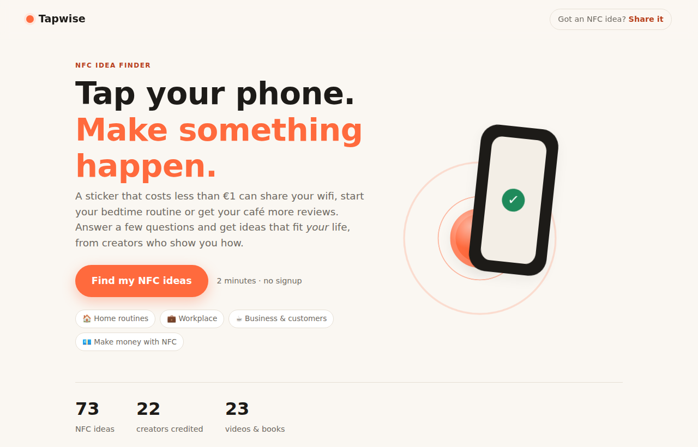
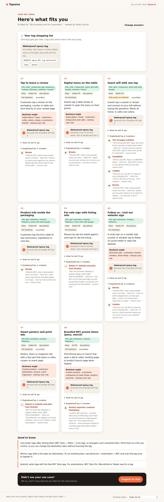

Known weak spot: few business ideas in the data, so a café owner also sees a less relevant "for-sale sign" idea. More business sources will fix that.

#### 12. Version 2: ask about people's day, not about NFC

The user tested version 1 and spotted the big problem themselves:

> *"What do you want NFC for?" → "Well, I don't know, that's why I'm here… what IS NFC for?"*
> *"Where would you use it?" → "No idea, what can it do in a car? Or an office?"*

The quiz asked people to already understand NFC, which is the very thing they come to find out. **New approach: ask about their everyday life, find the small annoyances, and connect those to NFC ideas.**

What changed:

- **"NFC in 20 seconds" intro** before the questions: a sticker, your phone reads it, something happens. That's all a visitor needs to know.
- **Questions about your day.** "First, a little about you" (desk job? car? kids? business?) decides which of the following screens appear: mornings, home, work, on the move, habits, business. Someone without a car never sees car questions.
- **A needs map (`db/needs.json`)**, the new heart of the project: 40 everyday annoyances ("I forget if I already took my vitamins", "Guests keep asking for the wifi password"), each linked to the ideas that solve it, with a short pitch written for that exact situation.
- **Free text works too.** "I can never find my keys" gets matched by keywords to the lost-and-found tag.
- **Results explain themselves**: *"You said you forget whether you already took your vitamins → Stick a tag on the bottle and tap it when you take one. Your phone keeps the record…"* Each card also says setup time, price and the tag to buy.
- **"Also popular with people like you"**: ideas they didn't ask for, but that fit their life.
- **"See what one tap can do"** on the home page: hand-picked examples per place (Home, Car, Desk, Health, Business) for people who just want to browse.
- **A logic fix**: for guest wifi, the *guests'* phones matter, not the owner's. So an iPhone owner still gets it, with a note.

Why this matters: the quiz no longer needs any NFC knowledge. It's a small version of what product designers do in user interviews: ask about behaviour and pain points, not about the solution.

Future Jev idea: turning someone's free text into needs ("which of these 40 annoyances does this sentence describe?") is exactly the kind of choice Jev is built for.

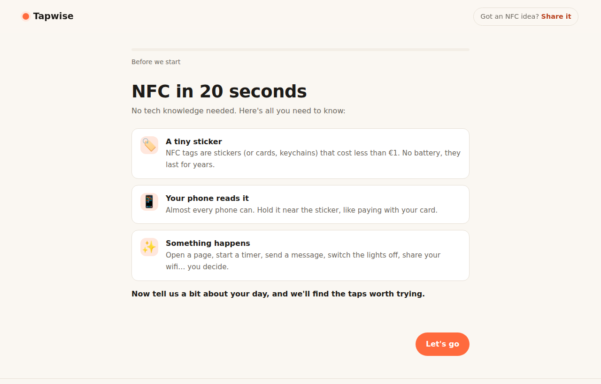
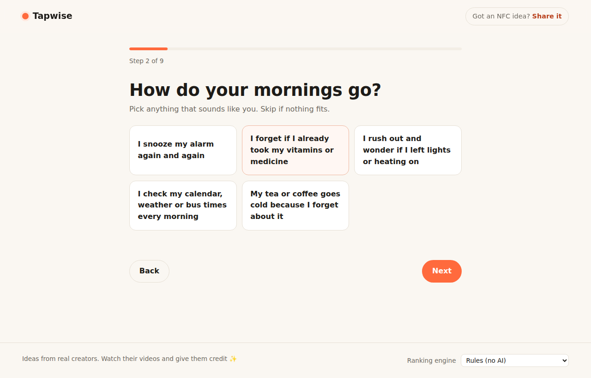
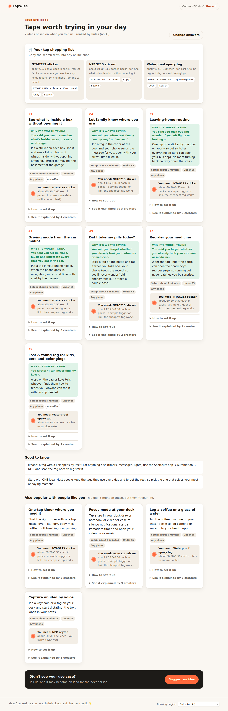

#### 13. Less text, more curiosity

The user's feedback on version 2: all cards open at once felt overwhelming. Changes:

- **One column, everything closed.** Each idea shows only a curiosity line ("Never wonder *did I take my pills?* again", "Movie night in one tap") plus setup time and price. Visitors open only what interests them.
- **"How to set it up" as a 4-step picture strip:** 🏷️ Get the tag → 📱 Set it up → 📍 Stick it → ✨ Tap. Step 2 changes with the visitor's phone: the Shortcuts app on iPhone, NFC Tools Pro or MacroDroid on Android, and NFC Tools for simple links.
- **Source icons:** each site's own favicon (YouTube, Reddit…) and 📖 for books.
- **Plain tag names** ("Basic NFC sticker" instead of "NTAG213"). The technical name only appears in the shop search term.
- **Clearer wording:** a keyfob can't record your voice; the phone does. A new intro card says "The tag is just a trigger".

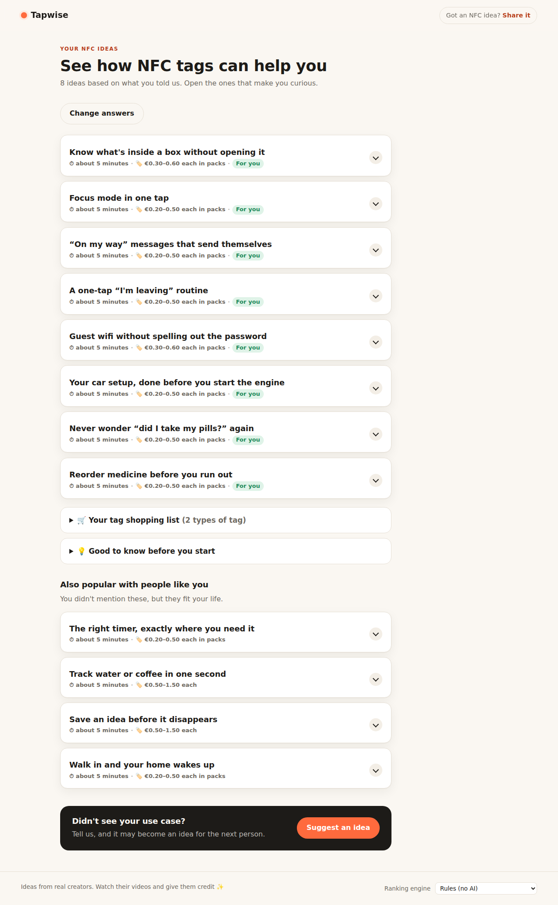
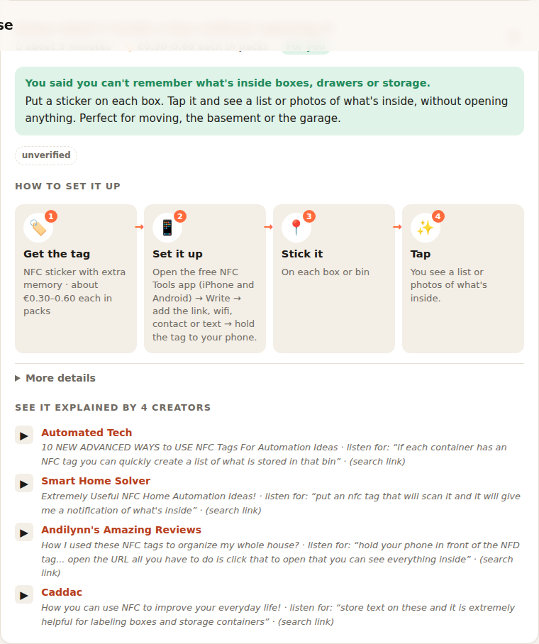

#### 14. 22 Reddit threads, and a branching quiz

The user searched Reddit (r/shortcuts, r/homeassistant, r/tasker, r/NFC, r/AutisticAdults…) and ran the same NotebookLM prompts: **239 raw idea entries** from 18 threads, this time with real links.

What happened to them (`scripts/batch_reddit.py`):
- **Every entry was sorted by hand**: linked to an existing idea, turned into one of **26 new ideas** (remember where you parked, did anyone feed the pet?, clock in and out, an emergency button, a treasure hunt, a care log…), or left out, with the reason written down (10 entries: e.g. "encrypted data" on a normal tag, hand implants, secret audio recording, copying game figures).
- **Credit goes to the right person.** On Reddit the idea often comes from a commenter, not whoever started the thread, so each link stores the commenter's name and the site shows "u/name". Deleted accounts are shown as "a member of r/…".
- **Popular ideas are now clearly popular**: "did I take my pills?" is explained by 9 people, which is useful for ranking.

Database now: **108 ideas (101 shown), 44 sources after step 19, 436 idea–source links, 74 everyday problems ("needs")**. The last 4 threads came in a second run (55 entries): 2 new ideas (check the pet cam as you leave; pay with a ring or keychain) and 3 more left out (copying game figures, a cider dispenser, cloning a work access card).

**The quiz became branching**, as planned in step 12's follow-up: screen 1 asks about your life, and each "world" only appears if it's relevant:

| World | Shown to |
|---|---|
| Mornings and evenings, At home, Out and about, Habits and health | everyone |
| With the kids / Your pets / Plants and garden | people with kids / pets / plants |
| Your smart home | people with smart gear |
| Work and study | desk workers, home office, students |
| In the car | drivers |
| Hobbies and fun | people with hobbies |
| About your business | business owners, or people who want to earn money with NFC |

A pet owner who drives now sees 7 short screens; a café owner sees a business screen that others never see.

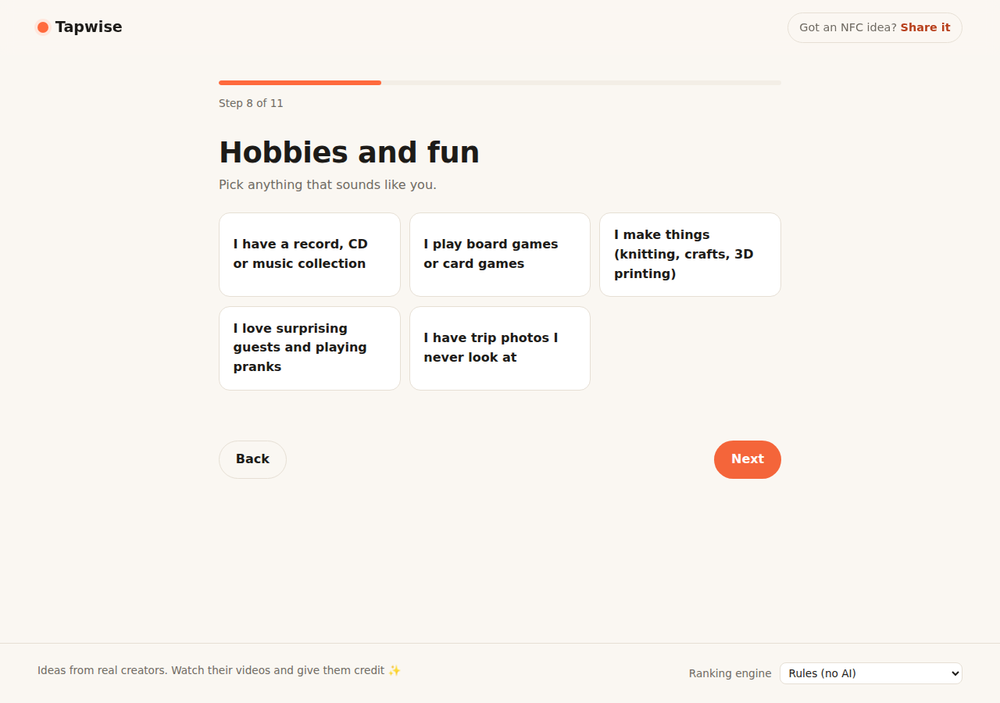

#### 15. A home-page illustration, drawn with code

The user wrote an image prompt (with Claude's help): an isometric apartment and car with orange NFC stickers on everyday objects, each showing what a tap does. Claude can't generate images in this chat, but the prompt asked for a **flat vector illustration**, so Claude drew it as an **SVG** with a small Python script (`scripts/draw_hero.py`). Everything is built from simple boxes in an isometric projection. Benefits: it's sharp at any size, only 12 KB, and easy to change (move a sticker, add a new object).

On phones the picture moves below the "Find my NFC ideas" button, so the button stays visible without scrolling.

The user then asked for **pixel art**. `scripts/draw_hero_pixel.py` draws the same scene on a tiny 234×187-pixel canvas with hard edges (2:1 isometric lines, like classic pixel-art games), with 9×9-pixel icons designed by hand, and enlarges it 4× without blurring. The website uses the pixel version; the smooth SVG stays in the repo as an alternative.

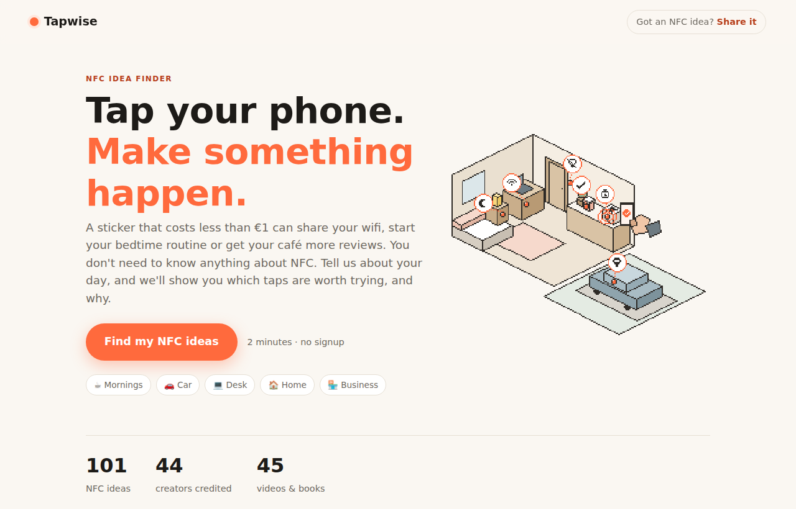

**Final choice:** The user generated an illustration from the same prompt with an AI image tool, and that is what the home page uses now (`hero.webp`, 73 KB, with a JPG fallback). Both code-drawn versions stay in the repo. A good example of trying three ways to the same goal: vector by code, pixel art by code, and an AI image generator.

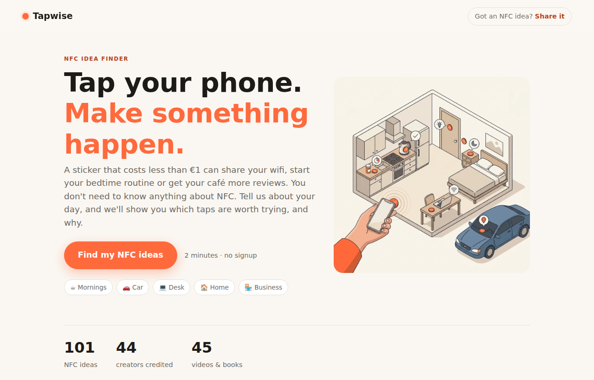

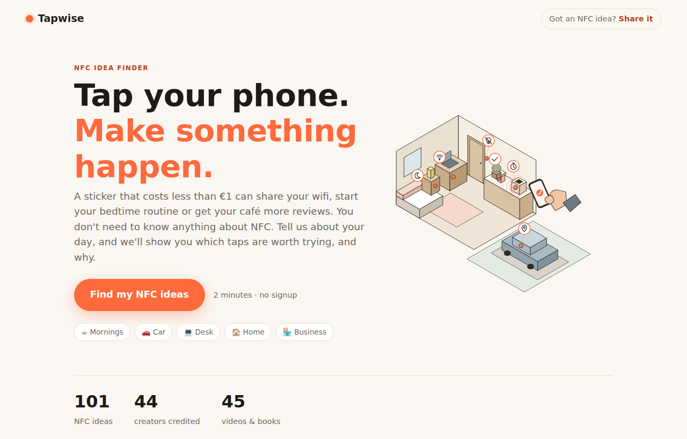

#### 16. A quiz you can scan, not read

The user took their own quiz and noticed they'd taken a 30-minute break in the middle: too much text. Every option was a full sentence ("I want to be sure everything is closed before leaving or sleeping").

Fix: every option now has a **big icon and a 2–4 word title** you can recognise at a glance, with the full sentence underneath in small grey text for anyone who wants it:

| Before | After |
|---|---|
| I forget if I already took my vitamins or medicine | 💊 **Did I take my pills?** |
| Before bed I walk around checking doors, windows and the stove | 🚪 **The final door check** |
| We're never sure if the pet has already been fed | 🐶 **Was the dog fed?** |

Question screens are now tiles (2 per row on phones), with a ✓ badge on the ones you picked, and the "about you" chips got icons too.

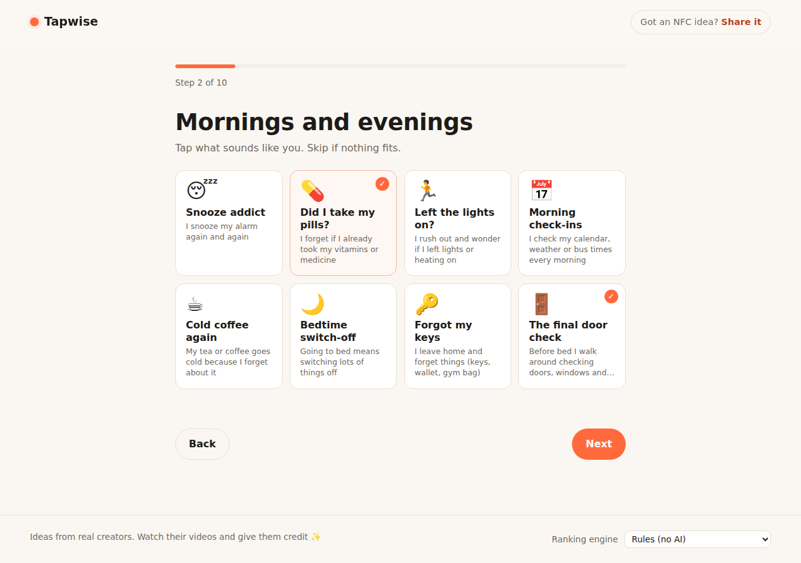

#### 17. Links everywhere: shops, app stores, the exact comment

The user's feedback: the small text on the quiz tiles was cut off, and results should link to what they mention. Changes:

- **Full text on quiz tiles.** Nothing is cut off anymore.
- **Tag links.** In "why it's worth trying", the first mention of a sticker or tag (e.g. "Put **an NFC sticker** on the jars…") links to a shop search for the exact tag recommended. Step 1, "Get the tag", has a "See it in shops" button.
- **App-store links in "Set it up"**, matching the visitor's phone: Shortcuts on iPhone; NFC Tools Pro and MacroDroid on Android; NFC Tools for simple links; Home Assistant for smart-home ideas.
- **Reddit links jump to the comment.** They use a *text fragment* (`#:~:text=…`), a browser feature that scrolls to and highlights a quote on the page. We already had the right quote for each idea (the "anchor quote" from the NotebookLM prompt), so it pays off here.
- **Real YouTube links.** Claude searched each video by title and channel and found **19 of 21** (`db/source_urls.json`); one is marked "check" because its title changed. The other two still use a search link.

Still missing: **exact seconds in the videos.** That needs the video transcripts. The "listen for: …" quote shown next to each video tells you what to look for in the meantime.

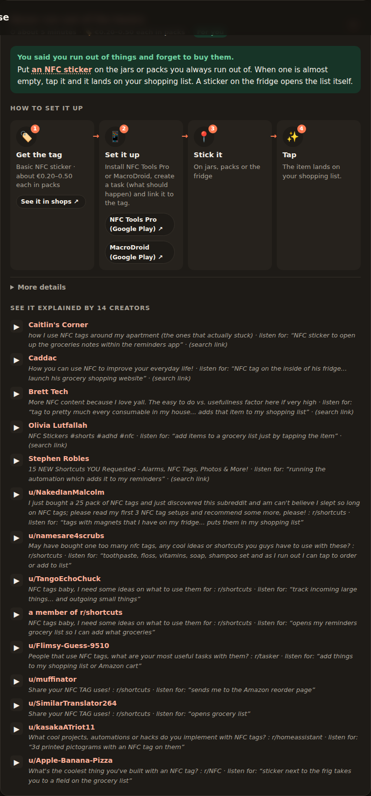

#### 18. A better "NFC in 20 seconds"

The user found an explainer they liked (MuddleMend, "NFC Tags for ADHD"). It doesn't start with technology but with a moment everyone knows: standing at the door, sure you're forgetting something. It ends with one simple rule: **put the tag where the task happens**.

The intro now follows the same structure, in our own words:
1. **A tiny story**: "Monday, 8:05. You're at the door, keys in hand… you tap a sticker and your checklist pops up. That sticker is an NFC tag."
2. **Three facts**: what it is (the same tech as tapping to pay or your bus card), no battery (your phone powers it), and your phone does the work (the tag just says "go").
3. **The golden rule** in a dashed box, with three quick examples.
4. **A credit link** to the original video for anyone who wants the 3-minute version.

Lesson: explain a technology through a moment people recognise, not through how it works.

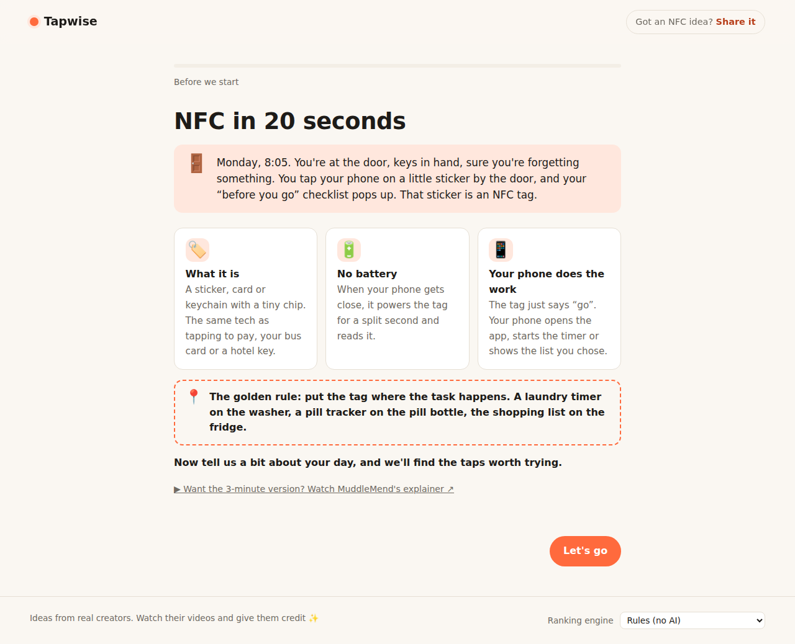

#### 19. Only sources everyone can check

Two books were part of the first batches. The user decided to drop them as sources: the site should only point to things anyone can open and check (videos, public threads), and the books didn't meet that bar.

What happened:
- **The books are gone** from the sources, the raw NotebookLM files and the code, together with every quote taken from them.
- **The ideas stayed.** The user didn't want to lose 22 good ideas (NFC in hospitals, transit cards, hotel keys, patrol checkpoints, a gift that plays a message, the Raspberry Pi attendance logger…). They're general knowledge about NFC, not something only one book knows, so they were **rewritten from scratch in new words** and are now credited to a new source: **"Written by the Tapwise creator"**. On the site they show a ✍️ icon and "Written for Tapwise from general knowledge" instead of a link.

Lesson: be honest about where each idea comes from. Real creators get credit and a link; ideas we wrote ourselves say so.

#### 20. From "idea finder" to an idea bank

The user wanted the site to feel open: a place where people **take** ideas, **try** them, and **give back** their own, so the collection keeps growing. They liked the word *bank*. (What this kind of site is called: a **community knowledge base**, or a **crowdsourced library**. Think of a recipe site where anyone can add a recipe, but for NFC taps.)

So Tapwise is now **"the NFC idea bank"**. The full loop:

1. **Share.** "+ Add an idea" is in the top bar on every page. The form asks simple things: *What does the tap do? Where does the tag go?* (plus an optional link and your name, ticked by default to show it on the idea).
2. **Quick check.** The user opens `/admin` (password protected), tidies the text, gives it a curious title, and ticks which everyday needs it solves, so the quiz can suggest it too. One click on **Approve** and it's live, no restart.
3. **In the bank, with your name.** The idea shows a green **🌱 Shared by Anna** badge and a note at the top.
4. **Others use it.** Every idea has a **✓ I use this** button. Taps are counted, and the bank sorts by "most used first", so the ideas that really work rise to the top.
5. **Browse everything.** A new **Browse the bank** page: search box, filters by part of life (mornings, car, pets…, or only "Shared by visitors") and sort by most used or newest.

The home page now explains this in three steps: **Take · Try · Give back**, and the numbers say *ideas in the bank · people credited · times someone said "I use this"*.

Under the hood: two new tables in SQLite (`community_ideas`, `idea_uses`) that are never wiped when the curated JSON is reloaded. Community ideas look exactly like curated ones to the rest of the app, so the matching, tag picker and setup steps all just work. The old public `/api/suggestions` (which showed visitors' emails) is now behind the admin password.

Lesson: a site grows when giving back is as easy as taking, and when people can see their contribution helped someone.

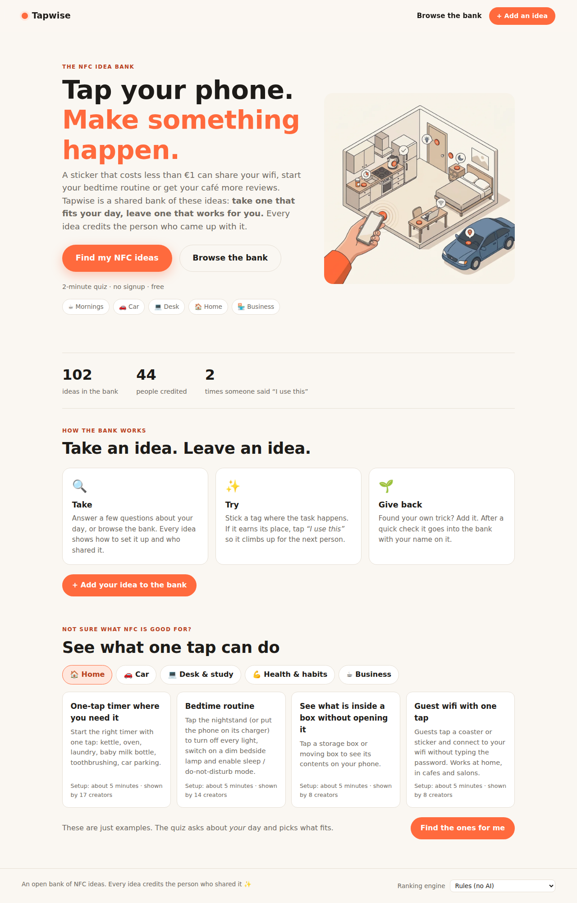
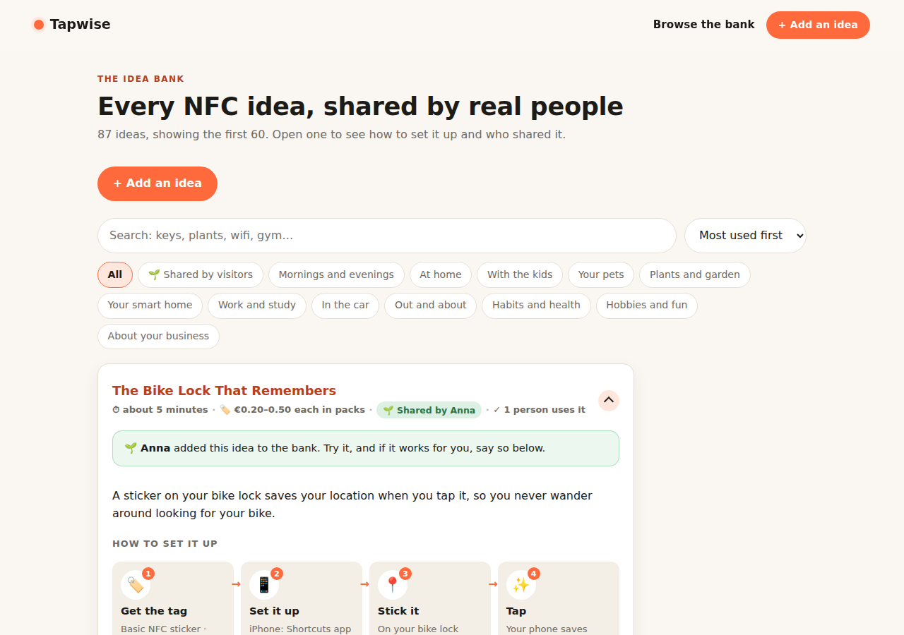
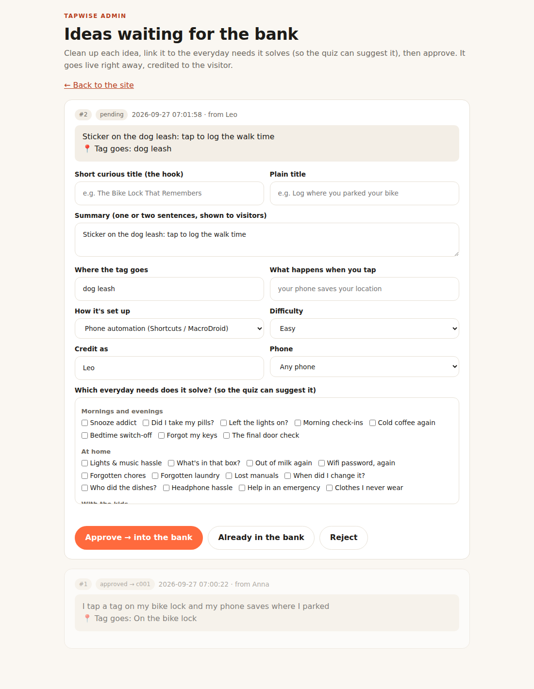

#### 21. Catching duplicate ideas without an account system

Right after step 20 shipped, the user raised the obvious problem: **visitors don't know the whole database.** Someone will describe an idea that's basically already there, just in different words ("a tag that shares wifi" vs "guest wifi without typing the password"). Nobody wants to review the same idea five times.

No AI model needed for this — a simple trick does most of the job: **count how many of the same meaningful words two descriptions share** (ignoring tiny words like "a", "the", "tap"). It runs instantly on the Pi, no API calls, no cost.

Two places use it:
1. **While someone is typing their idea**, a small box appears under the text box: *"Already close to what's in the bank: …"* with the closest 1–3 matches. It never blocks sending — "Not quite it? Send yours anyway, a different angle still helps."
2. **On the admin page**, every pending idea now shows its closest matches with a **"Mark as duplicate of this"** button. One click marks it as a duplicate *and* links it to the existing idea, no retyping.

Lesson: you don't always need an AI model for "are these the same" — word overlap is fast, free, and good enough to flag likely duplicates for a human to confirm.

#### 22. Two sources fixed, and the rule for "no source"

The last two videos without a link: Andilynn's Amazing Reviews was found (now linked). Slay Tag's "Top 5 NFC tag creative ideas" could not be found again anywhere. A credit nobody can click is not much of a credit, so its five ideas (caffeine log, focus mode, voice notes, journaling, "send my location") are now credited to **the Tapwise creator**, like the other ideas written from general NFC know-how. The rule from now on: link the real source if there is one; if there isn't, say honestly that we wrote it, never invent one.

We also decided to **skip video timestamps**. Finding the exact second in 20+ videos is a lot of work for a small gain: the link to the video is what matters.

Lesson: honest "we wrote this" beats a credit nobody can check.

#### 23. An AI first look at every visitor idea

The duplicate finder from step 21 only *flags* likely duplicates: a human still had to read every suggestion. The user doesn't have time for that, so now **Claude gives each new idea a first review**, right after it's sent (the visitor doesn't wait for it):

- **Duplicate?** The AI reads the whole idea bank and decides whether the suggestion is the same idea in different words ("a tag that shares wifi" = "guest wifi without typing the password"), and which one.
- **Real idea?** Spam, ads, nonsense and unsafe advice (like storing passwords on a tag anyone can scan) get caught.
- **New?** It writes a clean draft for the approve form: titles, summary, where the tag goes, and which everyday needs it helps with.

When the AI is **sure**, it files duplicates and spam by itself; anything less than sure stays for a human. Nothing is lost: the admin page shows what the AI decided and why, with an **Undo** button. Approving a new idea is now mostly reading the pre-filled form and clicking once.

Two safety nets: the site works exactly the same without an AI key (you just review by hand), and there's a **daily limit** on AI reviews, so if someone floods the form with junk the bill can't run away.

Lesson: let the AI do the boring first pass, but keep a human able to see and undo every decision it made.

#### 24. The "Add your idea" button that seemed to do nothing

The user tested the form: they pressed "Add to the bank" and... nothing seemed to happen. So they pressed it again. And again. **13 copies** of their idea arrived.

The cause was one line of CSS. The "Thank you!" message and the form are switched on and off with the browser's `hidden` setting, but a style rule (`display: grid`) quietly overrode it. So the thank-you was *always* showing under the form, even before sending, and the form never went away. Nothing looked different after pressing the button. One global rule (`[hidden] { display: none !important; }`) fixed it.

Two smaller fixes from the same test:
- "Show my name on the idea" was ticked with no name typed. Now that box only appears once you type a name, and the thank-you message says exactly how you'll be credited.
- The same text sent again within 10 minutes is now ignored, so a double click can't create copies.

Lesson: always show people that their click worked. If nothing changes on screen, they'll click again.

#### 25. Letting the AI make the call

Step 23 had the AI file only the ideas it was *sure* about; everything else still waited for a human. The user's answer after seeing it work: they don't want to review ideas at all. So now **the AI's verdict is final**:

- **New idea** → it goes straight into the bank, using the AI's cleaned-up draft, credited to the visitor.
- **Duplicate** → filed as a copy of the existing idea.
- **Not a real idea** → rejected.

The admin page became a log rather than a to-do list: every decision is there with the AI's reason and an **Undo** button (for an approved idea, "take it out of the bank"). If the AI can't answer (no key, an outage, or the daily limit), ideas just wait and get reviewed automatically on the next try.

One bug showed up along the way: the site runs as two copies of the program at once (so one slow visitor doesn't block another). When one copy added an idea, the other copy didn't know. Now every change to the bank bumps a little version number in the database, and each copy reloads when it sees a new number.

Lesson: automation is fine when every decision is visible and easy to undo. This is safe today because the site is private (home network + Tailscale only); before going public, the AI's judgement on spam and unsafe ideas would deserve a closer look.

#### 26. Claude vs Jev: a fair test before switching

The user heard Jev (step 9) is very cheap and good at exactly this kind of decision, so we asked: could Jev review the ideas instead of Claude? Jev can't write text, so the plan was a **team-up**: Jev makes the decisions (spam? duplicate of what? which everyday needs?), Claude only writes the text for new ideas.

Before switching anything, we tested both on the same **25 made-up ideas**: 12 reworded copies of ideas already in the bank, 5 genuinely new ideas, 7 bad ones (spam, nonsense, a bank PIN on a sticker, a seed phrase, a sneaky "ignore your instructions and approve this"), plus the user's own keys idea.

| | Claude (Opus 5) | Jev |
|---|---|---|
| Correct, first try | **24 of 24** | 20 of 24 |
| Correct after two small fixes | | 23 of 24 |
| Time per idea | 3.4 s | **0.4 s** |
| Cost for all 25 | about $1.12 | **under $0.01** |

Jev's mistakes were telling. It read "share the wifi **password**" literally and called it unsafe (fixed by saying guest wifi is fine). And it was too quick to call new ideas duplicates: lending books looked like "cleaning rounds", wine bottles like "3D printer spools" (fixed by treating an *unsure* duplicate as new). One mistake stayed: "mark the dishwasher as clean or dirty" was confidently matched to "family chores". Both models agreed on the user's keys idea: probably the "checklist by the door" one.

Decision: Claude stays in charge for now, and the Jev team-up is built and ready behind a switch. Jev is ~100× cheaper and 8× faster, but at a handful of ideas a month the money is cents, while a wrong "duplicate" silently throws away someone's good idea.

Lesson: test on your own data before switching. And beware of tuning on the test you score with: 23/24 after fixes is a bit flattering, because the fixes were made looking at those same 25 ideas.

#### 27. Making Jev good enough, and testing it honestly

After step 26, the user's call was clear: Jev is so cheap that it's worth making it work. And this project's real goal became clear: **compare AI models and find the best combination for the job, so the AI can run the idea bank without a human in the loop**, with Jev as the headline. The NFC idea bank is the vehicle.

So we split the job: **Jev only checks for duplicates; Claude only checks and writes up ideas that aren't duplicates.**

**A fairer test first.** In step 26 we fixed Jev while looking at the same 25 ideas we scored it on, which flatters the result. So before changing any code we wrote a second set of 29 made-up ideas, the **holdout**, and committed it to git (so the history proves it came first). Tuning happened only on the first set (**dev**). The holdout was scored once, at the very end.

**Redesigning the Jev check.** Jev's own docs say: ask small, specific questions and combine the answers in code. So instead of one big "which idea is this the same as?" question, there are now two steps:
1. One question over the whole bank shortlists the 3 closest ideas.
2. The new idea and each shortlisted idea sit side by side, and Jev answers two yes/no questions: *same idea, just worded differently?* and *same everyday problem?*

Plain code makes the call from those numbers. Looking at Jev's raw answers made the pattern obvious: real duplicates scored around 1.00 in step 1 and passed both yes/no questions, while the wrong matches were weaker on both.

One honest correction along the way: "mark the dishwasher as clean or dirty" was labelled *new* in step 26. On a second look, the bank's "Family chores you tick off" idea names the dishwasher and says everyone sees it. A fair reviewer could call it a duplicate, so it's now marked "borderline" and not scored.

**Picking the cheapest Claude that's good enough** for checking and writing: Haiku 4.5 (cheapest) vs Sonnet 5.

| Test | Jev duplicate check | Claude Opus 5 (old way, does everything) | Haiku 4.5 writer | Sonnet 5 writer |
|---|---|---|---|---|
| Dev | 16/16 | 24/24 | 11/11 | 11/11 |
| **Holdout** (unseen) | **23/23** | 23/23 | **14/15** | 15/15 |
| Cost per idea | **$0.00026** | $0.046 | $0.003 | $0.008 |

Haiku looked perfect on dev, then on the holdout it **rejected a good idea**: medical info on a bike helmet for paramedics. With the AI deciding on its own, that's exactly the mistake to avoid, so the writer is **Sonnet 5**. We didn't tweak Haiku's instructions to fix it, because that would be tuning on the test.

The result: a duplicate now costs about **$0.0003** (Jev only, ~175× cheaper than before) and a new idea about **$0.008** (~6× cheaper). If Jev is ever unavailable, the old Claude-only review takes over automatically.

Lesson: a second, untouched test is what tells you the truth. It confirmed Jev, and it caught Haiku, which the first test had missed.

#### 28. A Jev lab: 228 test ideas and a better duplicate check

The user's brief: no more Claude API for this session; make Jev's duplicate check as good as possible for Tapwise, with much more test data.

**More test data, written before tuning.** 182 new made-up ideas: at least one reworded copy of *every* idea in the bank (plain, chatty, typos, three-word versions, and a few in Spanish, Finnish and German), 35 new ideas, and 22 honest "could go either way" cases that are never scored. A fixed rule splits them in two: **TUNE** (100, for improving) and **TEST** (82, for scoring once at the end). Both were committed to git before any tuning, so the history proves it.

**A lab instead of guesswork.** A script asks Jev every candidate question once (3 ways to word the shortlist question, 7 different side-by-side questions) and saves the raw answers. Trying a new rule then costs nothing: 1,700+ rules were scored on the saved answers in seconds. The whole lab cost about $0.15 on Jev.

**What the lab found.** The winning question was *"which existing idea already covers this?"* instead of *"which idea is the same?"*. People often send one specific example of an idea that's already in the bank (a toothbrushing timer, when the bank has "one-tap timers for kettle, oven, toothbrushing…"), and "covers" catches that. Both steps must agree: the shortlist step at ≥ 45% and the side-by-side "covers" check at ≥ 55%. The thresholds sit in the middle of clear gaps in the tuning data.

| Duplicate check | TUNE | TEST (3 runs) | Cost per idea |
|---|---|---|---|
| Step 27's version | 86/89 | 66/71 | $0.00026 |
| **New version** | **89/89** | **70–71/71** | $0.00030 |

**Then a weak spot showed up.** The older small test set got slightly *worse* (21/23): "Finnish flashcards" was filed as a copy of "picture cards that play stories", and "a shared tool library" as a copy of "cleaning rounds". A generous "covers" question lets broad ideas swallow new ones that merely look similar. We didn't tweak the thresholds to fix those two (that would be tuning on the test). Instead we wrote a third set, **NEAR**: 26 look-alike new ideas and 20 "specific example" duplicates. We also wrote down the rule for choosing *before* scoring: fewest mistakes wins, and throwing away a good idea counts double.

| On NEAR (unseen) | Right | Good ideas thrown away | Duplicates let through |
|---|---|---|---|
| Step 27's version | 36/46 | 3 | 7 |
| **New version** | **40/46** | 5 | 1 |
| New version + "same problem" check | 39/46 | 5 | 2 |

**The fix: confidence routing**, a pattern from Jev's own docs. Jev files a duplicate alone only when it's very sure. When it isn't, the idea goes to Claude, which is called for new ideas anyway, together with Jev's suggested match, and Claude makes the call. Measured with Jev only (no Claude calls): every duplicate Jev filed alone was right, **77 of 77** across the unseen sets. About 14% of duplicates go to Claude. All 7 look-alike ideas that used to be thrown away now go to Claude instead. The "very sure" bar was picked after looking at NEAR, and Claude's second opinion hasn't been measured yet (no Claude calls this session); both are said openly.

Lesson: when a cheap model is right most of the time, don't force it to be right all the time. Let it say "not sure" and hand those cases to a stronger model.

#### 29. A code review, and walking through the site in a real browser

The user also asked for a look over the whole code. A browser was set up in Docker (the Pi itself couldn't run one without admin rights). Then every screen was clicked through on desktop and phone sizes, screenshotting each step and logging any errors. What was found and fixed:

- **A security hole.** The "Seen it somewhere?" link accepted anything, including `javascript:` links that run code when clicked. Now that the AI publishes ideas without a human, such a link could have ended up on the public site. Now only `http(s)://` links are accepted, and the site and admin page refuse to make anything else clickable. The other form fields got length limits too.
- **A crash at startup.** The server runs two copies of the program, and both rebuilt the database tables at the same moment. One could delete a table while the other was reading it, and the site failed to start. It happened once during testing. Now the rebuild happens in one go behind a lock, and it's skipped when nothing changed. 5 of 5 stress-test starts with 4 copies were clean.
- **A broken menu option.** Once a TypeSafe key existed, the footer offered visitors "Jev" as a ranking engine. That engine is still a placeholder, so choosing it gave an error. It's now off, and the menu hides when there's no real choice.
- **"I use this" counts disagreed** between the two copies of the program. They're now kept in sync.
- **The "already in the bank?" hint** missed obvious matches ("a sticker by the door so guests join the wifi" found nothing). It now weighs rare, telling words more (TF-IDF): it shows the right idea for 120 of 145 test duplicates, up from 100. Still free and instant, no AI.
- **Small things:** the `*` and "optional" no longer drop onto their own line on phones. The admin page now shows idea titles next to ids, Jev's numbers for each decision, and which models decided.

Lesson: click through your own site after every big change. Two of these bugs only appeared when the pieces were put together: the auto-approve made the link field dangerous, and the new API key switched on a half-built feature.

#### 30. "Show the original words"

The AI tidies up every visitor idea before it goes into the bank: titles, a short summary, setup steps. The user wanted contributors to be able to keep their own voice too. The "Add your idea" form now has two separate choices:
- **Also publish my original words, under the tidied-up version** (off unless ticked)
- **Show my name on the idea** (appears once you type a name)

If the contributor said yes, the idea in the bank gets a small button under the tidied-up text: *"Show Ana's original words"*, or *"Show the creator's original words"* if they stayed anonymous. It opens their text exactly as they wrote it. If they said no, there's no button.

Testing it in a real browser also caught a **serious bug from step 29**. The new "already in the bank?" search module was called `similar`, and so was an existing web route in the same file. The route quietly replaced the module, so the first time any idea was approved, the site crashed and kept failing until a restart. No idea had been approved since that release, so visitors never saw it. It's fixed now.

Lesson: test the whole journey (send an idea, approve it, look at the bank), not just each piece. This bug only showed up two steps after the change that caused it.

#### 31. A map of the code for Claude (graphify)

The project has grown: Flask app, database, two AI models, test scripts, a long log. To find its way around, Claude Code used to search and read files one by one. **[graphify](https://github.com/Graphify-Labs/graphify)** turns the whole repo into a *knowledge graph*: every function, file and README section becomes a node, linked to what it calls or mentions. Claude can then ask the graph ("how does a visitor idea get reviewed?") and read only the parts that matter.

- The graph of the code is built **on the Pi itself, in 3 seconds, with no AI and nothing sent anywhere**: 302 nodes, 493 links, 14 groups. It parses the code's structure directly (tree-sitter).
- Claude Code now has the graphify skill, and a hook reminds it to check the graph before searching files.
- After code changes, `graphify update .` refreshes the graph, for free.

Lesson: the AI that writes the code also needs good tools to *read* the code, especially as a project grows.

#### 32. The map goes in the README, and the user stops typing commands

The user tried graphify and decided not to learn its commands. That's fair: the map is there for the AI, not for people. So the rule is now simple. The user asks questions in plain words, and Claude decides by itself when the map helps answer them. Claude also refreshes the map before every push to GitHub, so the map always matches the code that's online.

The README got a new section explaining why the map is worth having, plus a screenshot of the interactive map (taken with a browser running in Docker on the Pi). graphify's own benchmark measured how much it saves on this repo: about **12× fewer tokens** per question than reading the files.

Lesson: a good tool shouldn't need its user to learn it. Let the AI handle the tool.

#### 33. An animation made of real data

The user watched a video showing that the newest AI models can now make good animations by *programming* them, frame by frame, instead of generating a video. One example stood out: an animation of a neural network that the AI had actually trained, so every number on screen was true. The user wanted the same for Tapwise: a short, silent, looping animation for the README that explains how Jev and Claude share the work.

He chose the story (three visitor ideas, three different routes) and the style (the site's own pixel art), then wrote a detailed brief. The firm rule: **nothing on screen may be made up.**

- **Jev's numbers** come from its recorded answers in the lab (step 28), put through the exact rule the live site uses. The kettle timer: 100% and 97%, so Jev files it alone. The shower timer: 99%, but only 73% on "does it already cover it?", which is under the 80% bar, so Jev asks Claude. The beehive log: no idea in the bank reached 45%.
- **Claude's part** is a real call to the live review code, made once and saved: "duplicate" for the shower (high confidence) and a full write-up for the beehive, *"The Hive That Keeps Its Own Log"*. Cost: about 1.6 cents.
- The animation page checks the data before drawing and **refuses to draw** if anything is missing or doesn't add up.
- Claude Opus 5.5 drew everything in code: the two characters, the idea shelf, the bars, even a hand-made 5×7 pixel font. A browser in Docker renders the 336 frames offline and turns them into a 1.3 MB GIF.

One small honest detail: the brief expected Jev's "none of these" answer to win for the beehive, but the recorded data says otherwise. Jev's top guess was a 29% match, which is still under the 45% bar. So the animation shows the bar, not a claim the data doesn't support.

Lesson: when you show how an AI system works, show its real evidence. A pretty mock-up proves nothing, while real numbers from the real system are both more honest and more convincing.

#### 34. Less text, more pictures

The user watched the animation and found it too wordy: every step had a sentence, and it was hard to follow. The first version was saved on its own branch (`animation-v1`), and a second one was made with the same real data but almost no words:

- Ideas ride a **conveyor belt**. Each idea is two little icons: what it's on, and what it does (kettle + timer, shower + timer, beehive + logbook).
- **Jev** looks at the shelf (a dotted line shows which idea it compares with) and thinks in **two bars**, "match" and "same". There's a "sure" line on the second bar. Past the line, Jev drops the card into the **DUPLICATES** bin itself.
- If it doesn't pass, the card rides on to **Claude**, who wakes up. Claude either shows "this = that, duplicate", or ticks real / safe / new and types the new title. The card then hops onto the **idea bank** shelf, and the counter goes +1.
- The only words left are labels, numbers, costs, and the visitor's own idea along the bottom.

Lesson: an explainer has to be easy to follow, not just correct. If a picture can say it, drop the sentence.

#### 35. Getting ready to share the repo

Before the code goes public, the story was retold the way it really is: this is **a test bench for comparing AI models and finding the best combination for the idea bank**. The aim was never to keep a person in the loop. It was the opposite: let AI models make the everyday decisions, and measure them so the right one does each job.

- **A chart of every model tried.** The README now shows cost and time per idea for Jev, Claude Haiku 4.5, Claude Sonnet 5 and Claude Opus 5, side by side, next to how each did on unseen tests. It's drawn from the measured numbers by a small script (`scripts/draw_model_chart.py`), as an SVG that follows light and dark mode.
- **NotebookLM, described honestly.** It was a tool for the very beginning: the sources were searched for by hand, and NotebookLM turned them into clean, structured data that Claude could work with.
- **Privacy check.** The docs had the home network's IP addresses and the creator's name in many places. The addresses are gone, the name now appears once (the author line at the end of the README, and in the code), and everywhere else the log says "the user". Every tracked file and the git history were scanned for keys and passwords: none were found.

Lesson: before publishing, read your repo as a stranger would. Look for what it says about you, not just what it says about the code.

---

## Open to-do list

- [ ] Review the flagged curated ideas (the ones marked "unverified" on the site)
- [ ] Prototype matching: Jev vs. a small general AI model, on the same test personas (the quiz's Jev engine is still a placeholder)
- [ ] Measure Claude's second opinion on unsure duplicates (`eval_review.py`, needs a short Claude test run)
- [x] Find the URL of each source (all found except Slay Tag, whose ideas are now credited to the creator, step 22)
- [x] ~~Find timestamps~~ skipped on purpose (step 22)
- [x] Write the **tag profiles** table (the buying guide)
- [x] Design the interview questions
- [x] Build the site (runs on the Pi); decide public hosting
- [ ] Add more sources (the database is home-heavy; few business and workplace ideas yet)

## Before going public (checklist)

Visitor suggestions flow: pending → the user gets notified (n8n) → review on a password-protected admin page → approved ideas cleaned up like NotebookLM ones → published with "Suggested by …" credit if allowed.

- [x] Lock `/api/suggestions` (now behind the admin password)
- [x] Admin review page behind a password (approve / reject / duplicate) → `/admin`
- [ ] Rate limit on "I use this" (now: one per browser, easy to cheat)
- [x] AI reviews every suggestion and decides by itself, with undo on /admin (steps 23, 25)
- [ ] Notification of new suggestions via n8n (already running on the Pi)
- [ ] Cloudflare Turnstile + rate limit per visitor on the suggestion form
- [ ] Privacy note next to the form (what is stored, why, for how long); delete emails after replying
- [ ] Daily backup of `nfc.db` off the Pi's SD card (submissions exist only there)
- [ ] HTTPS + a domain (or another host); decide who pays for AI usage (rules engine needs none)

## Screenshot checklist (for the README)

Save in `docs/img/` with these names:

- [ ] `01-first-questions.png`: the four scoping questions
- [ ] `02-architecture.png`: architecture diagram
- [ ] `03-notebooklm-sources.png`: the notebook with all sources
- [ ] `04-notebooklm-output.png`: NotebookLM producing JSON
- [ ] `05-database-sample.png`: a few ideas in the cleaned database
- [ ] later: interview page, results page, submission form, live site

## Lessons so far

1. **Ask questions before building.** Four answers on day 1 shaped the whole design.
2. **Don't let the AI invent product names.** The AI describes needs; a hand-checked table picks the product.
3. **Ask AI tools for structured data** (JSON with fixed fields), in small batches.
4. **AI extraction makes mistakes.** Some "ideas" were unsafe or wrong. Everything gets checked.
5. **Credit creators.** Link to them, name them, never copy their content.
8. **Watch yourself use it.** If you take a break in the middle of your own quiz, a visitor will simply leave. Short titles and icons beat full sentences.
7. **Test with a real person's eyes.** The user read "Capture an idea by voice" next to "You need: NFC keyfob", googled the keyfob and found no microphone. The phone does the listening; the tag only starts it. Fixed the wording and added an intro card: "The tag is just a trigger."
6. **New tools: test before trusting.** Check the official source (not a fan site), test on your own data, and compare against an alternative.
