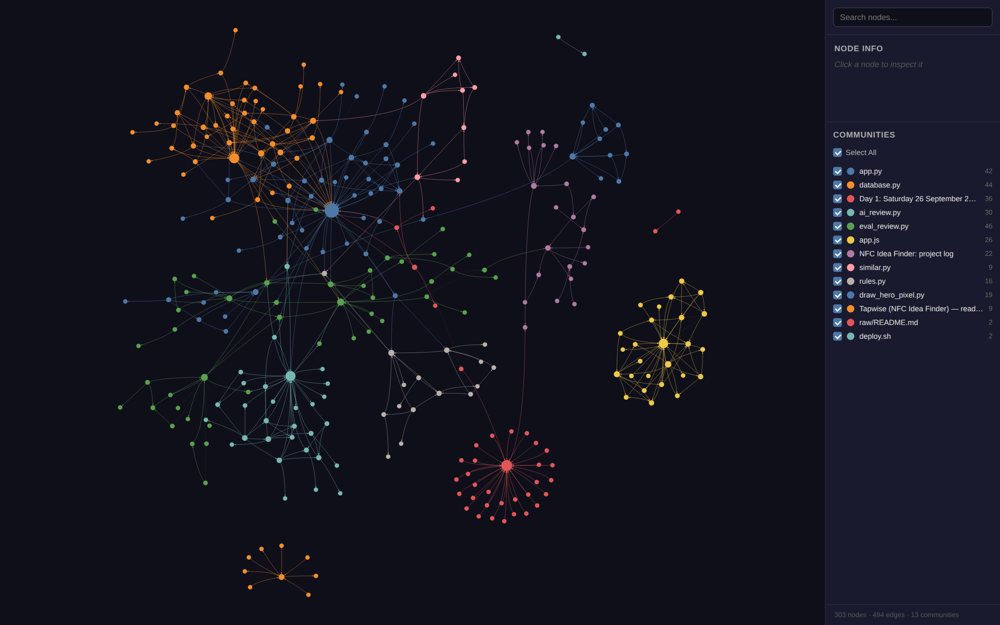

# Tapwise: NFC ideas, reviewed by Jev + Claude

**This repo is really about one thing: a human staying in the AI loop and picking the right model for each job, with numbers to back every choice.** The vehicle is a small website, Tapwise, that suggests everyday NFC tag ideas that fit your life and lets visitors add their own.

The headline choice: visitor ideas are checked for duplicates by **[Jev](https://docs.typesafe.ai)**, a new kind of AI model from TypeSafe that doesn't write text at all. It only answers typed questions with calibrated probabilities. On 228 test ideas it decides most duplicates on its own, at **about 1/175th of Claude Opus 5's cost**, and every duplicate it filed alone was right (77/77 on the unseen sets). When it isn't sure, it hands over to Claude. Claude also does what Jev can't: judging whether an idea is real and safe, and writing it up nicely.

Built by the user together with Claude (Anthropic), NotebookLM (Google) and Jev (TypeSafe). Work in progress, private for now.


### The AI toolbox at a glance

AI here isn't one chat window. It's a team of tools, each with one job, and a human deciding who does what:

| Tool | Its job in this project | Kind of AI |
|---|---|---|
| **Claude Code** (Anthropic) | Plans with the user, writes the code, tests it, deploys it | coding agent |
| **NotebookLM** (Google) | Read 40+ videos and Reddit threads and pulled out the ideas, with sources | research assistant |
| **Jev** (TypeSafe) | Decides "is this idea already in the bank?" for a fraction of a cent | decision model (no text at all) |
| **Claude Sonnet 5** (Anthropic) | Checks new ideas are real and safe, and writes them up | language model |
| **graphify** | Keeps a map of the whole codebase so Claude can find its way around | code map for the AI (no AI needed to build it) |
| **plain code** | Quiz matching, the "already in the bank?" hint | no AI, on purpose |

Every choice was tested before it was made, and the numbers are below.

## Two AI models, two jobs: a filter and a writer

When a visitor adds an idea to the bank, two different AI models handle it, one after the other.

**1. Jev (TypeSafe) is the filter: "is this already in the bank?"**
Jev compares the new idea with every idea in the bank and answers with probabilities, not text. Most suggestions repeat something the bank already has, so this filter sees every idea, and it has to be cheap and fast. Jev costs about **$0.0003 per idea** and answers in under a second.
- If Jev is **sure** it's a repeat, the idea is filed as a duplicate right there. No other model is called.
- If Jev **isn't sure**, or the idea is new, the idea passes the filter and goes to step 2. When Jev wasn't sure, it also sends along the idea it suspects is the original.

**2. Claude Sonnet 5 (Anthropic) is the writer: "add the new idea to the bank".**
Only ideas that pass the filter reach Claude. Claude:
- **checks** that the idea is real and safe (no spam, no "put your PIN on a sticker"),
- **makes the final call** when Jev wasn't sure whether it's a repeat,
- **writes it up** for the site: a catchy title, a plain title, a short summary, where the tag goes, what happens when you tap, how hard it is to set up, which phones it works on, and which everyday problems it solves.

The idea then goes live, credited to the visitor. Jev can't do this step, because it doesn't write text. Claude can, but it would be wasteful as the filter: Claude Opus 5 doing the whole review costs about 150 times more per idea than Jev.

### Choosing the most efficient Claude for the writer job

"Most efficient" means **the cheapest Claude that does the job right**, because a mistake here is costly: the AI publishes ideas with no human checking them. This choice was made from tests that had already been run (step 27 in the log), with no new Claude API calls: the same 15 unseen test ideas, 9 good ideas and 6 bad ones, given to each candidate.

| Claude model | Got right | Cost per idea | Speed | Verdict |
|---|---|---|---|---|
| Claude Haiku 4.5 (cheapest) | 14/15: **rejected a good idea** (medical info on a bike helmet, for paramedics) | $0.003 | 2.3 s | ✗ cheapest, but it throws away good ideas |
| **Claude Sonnet 5** | **15/15** | **$0.008** | 3.8 s | ✓ **chosen**: the cheapest model that got everything right |
| Claude Opus 5 | not run as the writer (it got everything right as the all-in-one reviewer) | ≈ $0.02 (estimate, about 2.5× Sonnet's price) | slower | ✗ more power than the job needs |

Sonnet 5 costs about half a cent more per new idea than Haiku 4.5. That's the price of not losing good ideas. Its write-ups were also cleaner, and it picked more fitting "everyday problems". It runs at low "effort" (a setting that limits how much the model thinks before answering), which is enough for a short write-up. If a future test shows a cheaper model doing as well, switching is one setting: `TAPWISE_WRITER_MODEL`.

## Which model does what, and why

| Job | Model | Why this one | Measured |
|---|---|---|---|
| **Is a visitor's idea already in the bank?** | **Jev** (TypeSafe) | A decision, not a text. Jev returns probabilities your code can branch on, and only charges for input ($0.042 per million tokens). | **70–71 of 71** unseen ideas right · when sure, **77/77** right · 0.6 s · **$0.0003 per idea** |
| Jev thinks it's a duplicate but isn't sure (~14% of duplicates) | Claude Sonnet 5 | A second opinion only where it's needed ("confidence routing"). Rescues new ideas that merely *look* like an existing one. | part of the Claude call below |
| Is a new idea real and safe? Write it up for the site | Claude Sonnet 5 | Needs judgement *and* good writing, which Jev can't do. Haiku 4.5 was cheaper but rejected a good idea in testing. | 15/15 right on unseen ideas · 3.8 s · $0.008 per idea |
| Fallback if Jev is unavailable: everything in one call | Claude Opus 5 | Does the whole review alone, very accurately, but costs the most. | 23/23 · $0.046 per idea |
| Pull ideas out of 40+ videos and Reddit threads | NotebookLM | Built for reading many sources at once and citing them. | every idea checked by hand |
| Match quiz answers to ideas | **no AI**: simple rules | Fast, free, offline, predictable. Not every job needs a model. | |
| "Is this already in the bank?" hint while typing | **no AI**: TF-IDF word matching | Instant and free; a hint, not a decision. | right idea shown for 120 of 145 test duplicates (83%) |
| Plan the project and write the code | Claude (Claude Code) | the user decides; Claude proposes, explains and builds. | |
| Help Claude find its way around the code | **graphify** (no AI to build it) | A map of the code is cheaper and safer than reading every file each time. | ~12× fewer tokens per question · rebuilt in ~1 s |

Every visitor idea goes through this pipeline:

```
visitor idea ──> Jev: already in the bank?
                  │
                  ├─ yes, and sure ──────────────> filed as a duplicate (no Claude call: $0.0003)
                  │
                  ├─ maybe (not sure) ──┐
                  └─ no ────────────────┤
                                        v
                 Claude Sonnet 5: really a copy? real and safe?
                  ├─ copy ──> filed as a duplicate
                  ├─ junk or unsafe ──> rejected
                  └─ new ──> written up, credited to the visitor, live in the bank (≈ $0.008)
```

Every decision is listed on the admin page with the reason and an **Undo** button.

## Why Jev, and how we made it work

Jev is a "System One" model: you send it a *state* (some text) and typed *questions* (choose one option, give a score, or is this true?), and it answers each with probabilities and a confidence. It's built for fast, structured decisions, and the pricing reflects that. the user wanted to try something this new on a real task rather than just read about it.

**First try: not good enough.** One Jev question per idea ("which existing idea is this the same as?") got **20/24**. It called some genuinely new ideas duplicates ("lending books" matched "cleaning rounds", wine bottles matched "3D printer spools"). With the AI approving ideas automatically, that would quietly throw away good suggestions. Claude Opus 5 got 24/24.

**Second try: two steps, small questions** (following Jev's own advice to ask atomic questions and combine them in code): a shortlist question over the whole bank, then each likely match side by side with the suggestion. That got 23/23 on a small unseen test, but a much bigger test showed it still let too many duplicates through.

**Third try (live now): "does it already cover it?"**

1. **Shortlist:** one Choice question over the whole bank: *which existing idea already covers this suggestion, so adding it would repeat it?*
2. **Side by side:** each likely match (≥ 45% in step 1) next to the suggestion, one yes/no question: *does the existing idea already cover it, even if the suggestion is one specific example of it?*
3. **Plain code decides:** a duplicate if step 2 says ≥ 55%. Both steps must agree.
4. **Confidence routing:** Jev files a duplicate on its own only when it's very sure (step 1 ≥ 95% and step 2 ≥ 80%). Otherwise Claude, which is called for new ideas anyway, gets Jev's suggested match and makes the final call.

**How we found it: a lab, and tests we didn't peek at.** [`scripts/jev_lab.py`](scripts/jev_lab.py) asks Jev every candidate question once (3 shortlist wordings, 7 side-by-side questions) and saves the raw answers ([`scripts/lab_results/`](scripts/lab_results/)). Then hundreds of decision rules are tried on the saved answers for free. The test ideas ([`scripts/review_cases_big.py`](scripts/review_cases_big.py)) were written and committed to git **before** any tuning on them:

| Test set | What's in it | Used for |
|---|---|---|
| TUNE | 100 ideas: reworded duplicates of every bank idea, new ideas, other languages, typos | tuning only |
| TEST | 82 other ideas, same mix | scoring once the rule was frozen |
| NEAR | 46 ideas aimed at the weak spot: new ideas that *look like* a bank idea, and "one specific example" duplicates | choosing between the final versions (the rule for choosing was written down first) |

| Duplicate check | TUNE | TEST (unseen, 3 runs) | NEAR (unseen) | Cost per idea |
|---|---|---|---|---|
| Second try | 86/89 | 66/71 | 36/46 | $0.00026 |
| **Third try** | **89/89** | **70–71/71** | **40/46** | **$0.00030** |
| Third try, Jev alone when sure | | **50/50** filed right | **13/13** filed right | |

Jev's answers vary a little from run to run (one TEST case sits right at the threshold), so we report all three runs. The weak spot is honest and known: on NEAR, 5 of 26 look-alike new ideas looked like duplicates to Jev, e.g. "office coffee machine tells facilities it needs descaling" vs "remember when you last cleaned something". None of those 5 were "sure", so routing sends them all to Claude instead of throwing them away. Run it yourself: [`scripts/eval_review.py`](scripts/eval_review.py) (`dupes`, `route`).

**Honest limits.** These are made-up test ideas written by us, not real visitors yet. The "sure" bar (95% / 80%) was picked after seeing NEAR. Claude's second opinion on unsure duplicates is built and wired up but hasn't been measured yet (that needs a short Claude test run). Jev reads questions literally, and it can't write, which is why Claude stays in the pipeline.

## What it costs: Jev vs Claude

AI models charge per **token** (roughly ¾ of a word): once for what they read (input) and once for what they write (output).

**The price lists** (US dollars per million tokens, October 2026):

| Model | Reading (input) | Writing (output) |
|---|---|---|
| **Jev** (TypeSafe) | **$0.042** | **free** (it only returns short answers, no text) |
| Claude Haiku 4.5 | $1 | $5 |
| Claude Sonnet 5 | $2 | $10 |
| Claude Opus 5 | $5 | $25 |

Reading costs about **24× less with Jev than with Haiku**, Claude's cheapest model, and **119× less than with Opus**. Jev also charges nothing for its answers.

**One duplicate check, measured** (average over the test ideas):

| | Tokens read | Tokens written | Cost | Time |
|---|---|---|---|---|
| **Jev** (shortlist + side-by-side check) | ~7,200 | answers only (free) | **$0.00030** | 0.6 s |
| Claude Opus 5 (the whole bank in one prompt) | ~8,300 | ~150 | $0.046 | 3.4 s |

Both models read about the same amount, because both have to look at the whole idea bank. The difference is almost entirely the **price per token**: same accuracy on our test, **about 175× cheaper**.

**Per 1,000 visitor ideas**, assuming half are duplicates:

| Setup | Cost |
|---|---|
| Claude Opus 5 does everything | **$46** |
| Today's setup: Jev checks all 1,000; Claude Sonnet 5 handles the 500 new ones plus the ~70 duplicates Jev isn't sure about | **≈ $4.60** (Jev $0.30 + Sonnet $4.30) |
| The duplicate check on its own: Jev vs Opus 5 | **$0.30** vs $46 |

What's left of the bill is Claude doing what Jev can't: judging whether an idea is real and safe, and writing it up. For that we picked the cheapest Claude that passed the test (Sonnet 5; Haiku 4.5 was cheaper but rejected a good idea).

**What building and testing this cost** (1 October 2026, all test runs together): about **$2.50 on Claude**, most of it Opus 5 runs used as the comparison baseline, and about **$0.50 on Jev** for roughly 12 million tokens: the whole lab, every tuning run and every test run.

Prices change; check [Anthropic's pricing](https://www.anthropic.com/pricing) and [TypeSafe's models page](https://docs.typesafe.ai/models) for current ones. Costs here are calculated from the token counts our test scripts recorded.

## A map of the code, for the AI (graphify)

Here's a problem nobody mentions when people talk about "coding with AI": **every session, the AI starts with no memory of the project.** It's like a new developer joining the team every morning. To answer "how does a visitor idea get approved?", it has to open files one by one, read them, and guess how they connect. That's slow, it costs money (every word read is paid for), and on a big project it can easily miss something.

So this project gives the AI a map. **[graphify](https://github.com/Graphify-Labs/graphify)** reads the whole repo and turns it into a *knowledge graph*. Every function, file and section of the docs becomes a dot, and the lines between the dots say "this calls that" or "this mentions that". Groups of dots that belong together get their own colour:



*The real map of this repo (303 dots, 494 links). Blue in the middle is the web app, orange is the database, the green and teal groups are the test scripts and the AI review, the yellow island is the website's JavaScript, and the red star is the project log. You can click any dot to see what it connects to.*

Before Claude reads any code, it asks the map first. Then it only opens the few files that matter.

**Why it's a good idea:**
- **Cheaper and faster.** On this repo, answering a question from the map takes about **12× fewer tokens** than reading the files (graphify's own benchmark on sample questions). One question ("where does the app start?") was 64× cheaper.
- **Fewer blind spots.** Before changing something, Claude can see everything connected to it. The function that runs the AI review, for example, touches 10 other pieces: change it carelessly and something else breaks.
- **Free and private.** The map of the code is built on the Raspberry Pi in about a second, by reading the code's structure directly. No AI is needed for that, and nothing leaves the Pi.
- **Honest.** Each line on the map is labelled as either read straight from the code or guessed (with a confidence score). Here, 97% are read straight from the code.
- **Always up to date.** The map is refreshed every time work is pushed to GitHub, so it never describes old code.
- **It finds surprises.** The map links docs to code: for example, it connected the project log's "Show the original words" story to the function that powers it.

**The human stays in charge, and doesn't need to learn another tool.** the user asks in plain words ("what would break if I change the duplicate check?"), and Claude decides when to look at the map. Picking the right tool is part of the AI's job too, as long as it's the right one.

## More

- **The whole story, step by step** (every decision, mistake and lesson): [PROJECT_LOG.md](PROJECT_LOG.md)
- **How to run it** (Raspberry Pi + Docker): [RUN.md](RUN.md)
- **The AI review code:** [`app/ai_review.py`](app/ai_review.py)
